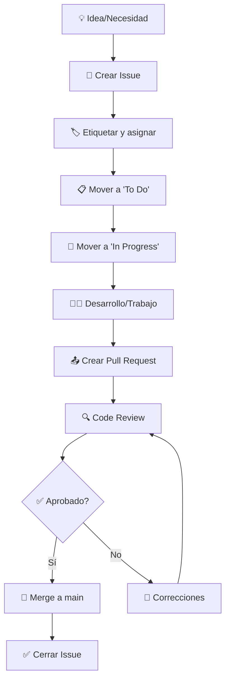

# 🚀 Flujo de trabajo del proyecto - Guía completa

## 📋 Visión general del workflow

Este documento define el **flujo de trabajo colaborativo** para el proyecto de Arquitectura de Computadores 2025. Nuestro workflow está diseñado para garantizar calidad, trazabilidad y eficiencia en el desarrollo colaborativo.

### 🎯 Principios fundamentales
- **🔍 Transparencia total:** Todo el trabajo es visible y trazable
- **🤝 Colaboración activa:** Revisión por pares obligatoria
- **📈 Calidad first:** Testing y documentación como prioridades
- **⚡ Iteración rápida:** Sprints cortos con entregas frecuentes
- **📚 Documentación viva:** Mantener docs actualizadas en tiempo real

---

## 🏗️ Estructura organizacional

### 👥 Roles y responsabilidades

| Rol | Responsable | Responsabilidades principales |
|-----|------------|------------------------------|
| **🎯 Project Lead** | Diego Díaz | Coordinación general, planning, decisiones técnicas |
| **⚡ SIMD Specialist** | Pablo García | Optimización vectorial, análisis de rendimiento |
| **🛠️ Infra & Testing** | Mateo Rama | Setup de entorno, CI/CD, testing automatizado |
| **📝 Docs & QA** | Fernando Suárez | Documentación técnica, revisión de calidad |

### 🎨 Áreas de trabajo
1. **💻 Infraestructura** - Setup, configuración, herramientas
2. **🧑‍💻 Código** - Implementación de algoritmos y optimizaciones  
3. **📄 Documentación** - Memoria técnica, guías, análisis
4. **✅ QA/Testing** - Revisión, testing, validación de calidad

---

## 📊 Gestión de trabajo con GitHub

### 🗃️ Issues: Motor de organización

#### Tipos de issues y plantillas
Cada tarea se gestiona como un **GitHub Issue** usando plantillas específicas:

| Plantilla | Uso | Label | Estimación típica |
|-----------|-----|-------|------------------|
| **🧑‍💻 Code Task** | Implementación/modificación código | `código`, `development` | 1-3 días |
| **📄 Docs Task** | Creación/actualización documentación | `documentación`, `escritura` | 0.5-2 días |
| **✅ QA Task** | Revisión, testing, validación | `QA`, `revisión`, `testing` | 0.5-1 día |
| **🛠️ Infra Task** | Configuración, setup, herramientas | `infraestructura`, `setup` | 1-2 días |
| **🐛 Bug Report** | Reporte de errores/problemas | `bug`, `error` | Variable |
| **🚀 Feature Request** | Propuesta de funcionalidades | `enhancement`, `propuesta` | Variable |

#### Lifecycle de un Issue


### 📋 Project Board: Kanban visual

Utilizamos **GitHub Projects** con metodología Kanban:

| Columna | Descripción | Criterios de entrada |
|---------|-------------|---------------------|
| **🟢 To Do** | Tareas planificadas pendientes | Issue creado y priorizado |
| **🟡 In Progress** | Trabajo activo en desarrollo | Asignado y rama creada |
| **🔵 Review** | En proceso de revisión | PR creado, esperando review |
| **✅ Done** | Tareas completadas | PR mergeado, issue cerrado |

#### 🏷️ Sistema de etiquetas
- **Prioridad:** `priority-high`, `priority-medium`, `priority-low`
- **Tipo:** `bug`, `enhancement`, `documentation`, `infrastructure`
- **Estado:** `blocked`, `help-wanted`, `in-review`
- **Complejidad:** `complexity-low`, `complexity-medium`, `complexity-high`

---

## 🌿 Estrategia de branching (Git Flow adaptado)

### 📐 Estructura de ramas

```
main                           # 🏠 Rama principal (siempre deployable)
├── feature/filtro-median     # 🚀 Nueva funcionalidad
├── feature/simd-optimization # 🚀 Optimización SIMD
├── bugfix/memory-leak        # 🐛 Corrección de error
├── docs/memoria-resultados   # 📄 Documentación
├── infra/ci-setup           # 🛠️ Infraestructura
└── hotfix/critical-bug      # 🚨 Fix crítico (directamente desde main)
```

### 📏 Convenciones de nomenclatura

#### Prefijos de ramas
- `feature/` - Nuevas funcionalidades o mejoras
- `bugfix/` - Corrección de errores no críticos
- `hotfix/` - Corrección urgente en producción
- `docs/` - Documentación exclusivamente
- `infra/` - Infraestructura, configuración, herramientas
- `test/` - Testing específico o mejoras en testing

#### Ejemplos de nombres descriptivos
```bash
feature/implementar-filtro-gaussiano
feature/optimizacion-simd-avx2
bugfix/corregir-memory-leak-filtros
docs/actualizar-manual-instalacion
infra/setup-automated-testing
test/anadir-benchmarks-rendimiento
hotfix/corregir-segfault-critico
```

### 🔄 Workflow de desarrollo detallado

#### 1. Preparación del trabajo
```bash
# Sincronizar con main
git checkout main
git pull origin main

# Crear nueva rama
git checkout -b feature/nombre-descriptivo

# Verificar rama activa
git branch --show-current
```

#### 2. Desarrollo iterativo
```bash
# Hacer cambios y commits frecuentes
git add -A
git commit -m "feat(filtros): implementar base del filtro mediano

- Añadir estructura básica de datos
- Implementar algoritmo de sorting
- Incluir validaciones de entrada

Refs #42"

# Push regular para respaldo
git push origin feature/nombre-descriptivo
```

#### 3. Preparación para merge
```bash
# Sincronizar con cambios en main (si los hay)
git checkout main
git pull origin main
git checkout feature/nombre-descriptivo
git rebase main  # o git merge main

# Push final
git push origin feature/nombre-descriptivo --force-with-lease
```

---

## 🔍 Pull Requests: Gateway de calidad

### 📋 Checklist obligatorio antes de crear PR

#### ✅ Verificación técnica
- [ ] **Código compila** sin errores ni warnings
- [ ] **Tests pasan** todos los casos relevantes
- [ ] **Documentación** actualizada si es necesario
- [ ] **Commits** son atómicos y bien descritos
- [ ] **Self-review** completado

#### ✅ Verificación del proceso
- [ ] **Issue vinculado** con `Closes #NUMERO`
- [ ] **Plantilla completada** exhaustivamente
- [ ] **Evidencias incluidas** (capturas, outputs, benchmarks)
- [ ] **Rama actualizada** con main
- [ ] **Conflictos resueltos** si los hay

### 🎯 Proceso de Code Review

#### Roles en el review
- **👨‍💻 Autor:** Responsable de implementar feedback
- **👨‍🔬 Reviewer:** Mínimo 1 compañero, preferiblemente 2
- **🎯 Maintainer:** Persona que hace el merge final

#### Criterios de evaluación
1. **🎯 Funcionalidad**
   - ¿El código hace lo que debe hacer?
   - ¿Se cumplen todos los criterios de aceptación?
   - ¿Los tests cubren casos importantes?

2. **🏗️ Calidad del código**
   - ¿Es legible y mantenible?
   - ¿Sigue las convenciones del proyecto?
   - ¿Está bien estructurado?

3. **⚡ Rendimiento**
   - ¿Es eficiente la solución?
   - ¿Se evitan anti-patrones conocidos?
   - ¿El impacto en rendimiento es aceptable?

4. **📚 Documentación**
   - ¿Los cambios están documentados?
   - ¿Los comentarios son útiles?
   - ¿La documentación externa está actualizada?

#### Estados del PR
- **🔄 Draft** - Work in progress, no listo para review
- **👀 Ready for review** - Completo y listo para revisión
- **🔧 Changes requested** - Requiere modificaciones
- **✅ Approved** - Aprobado, listo para merge
- **🔀 Merged** - Integrado en main

### 🎨 Merge strategies

#### Tipo de merge por contexto
- **Squash and merge** - Para features pequeñas (1-3 commits)
- **Merge commit** - Para features grandes con historial relevante
- **Rebase and merge** - Para mantener historial lineal (casos especiales)

---

## 📝 Documentación como código

### 🏗️ Estructura de documentación

```
docs/
├── 📄 README.md                    # Documentación principal del proyecto
├── 📄 workflow.md                  # Este documento
├── 📄 memoria.md                   # Memoria técnica principal
├── 📄 CONTRIBUTING.md              # Guía de contribución
├── 📁 technical/                   # Documentación técnica detallada
│   ├── 📄 architecture.md         # Arquitectura del software
│   ├── 📄 algorithms.md           # Descripción de algoritmos
│   ├── 📄 performance.md          # Análisis de rendimiento
│   └── 📄 optimization.md         # Técnicas de optimización
├── 📁 guides/                      # Guías y tutoriales
│   ├── 📄 setup-guide.md          # Guía de configuración
│   ├── 📄 development-guide.md    # Guía de desarrollo
│   └── 📄 troubleshooting.md      # Resolución de problemas
├── 📁 diagrams/                    # Diagramas técnicos
│   ├── 🖼️ architecture.png         # Diagrama de arquitectura
│   ├── 🖼️ workflow.png            # Diagrama de flujo
│   └── 🖼️ performance.png         # Gráficos de rendimiento
├── 📁 screenshots/                 # Capturas de pantalla
│   ├── 🖼️ vm-setup/                # Setup de VM
│   ├── 🖼️ compilation/            # Procesos de compilación
│   └── 🖼️ results/                # Resultados y outputs
└── 📁 data/                        # Datos y resultados
    ├── 📊 benchmarks.csv           # Resultados de benchmarks
    ├── 📊 performance-metrics.json # Métricas de rendimiento
    └── 📁 test-results/            # Resultados de tests
```

### 📐 Estándares de documentación

#### Formato y estilo
- **Formato:** Markdown (.md) para toda la documentación
- **Estilo:** Profesional, claro, con ejemplos prácticos
- **Estructura:** Headers jerárquicos, listas, tablas, código
- **Multimedia:** Diagramas, capturas, gráficos cuando añadan valor

#### Plantillas de documentación
- **Technical specs:** Para especificaciones técnicas
- **User guides:** Para guías de usuario
- **API documentation:** Para documentación de código
- **Meeting notes:** Para actas de reuniones

---

## 🧪 Testing y calidad

### 🎯 Estrategia de testing

#### Niveles de testing
1. **🔬 Unit Tests** - Funciones individuales
2. **🔗 Integration Tests** - Interacción entre módulos  
3. **🎭 System Tests** - Sistema completo end-to-end
4. **📊 Performance Tests** - Benchmarks y profiling

#### Herramientas de testing
- **Unit testing:** Custom test framework en C
- **Memory testing:** Valgrind para memory leaks
- **Performance:** `perf`, `gprof`, custom benchmarks
- **Static analysis:** `cppcheck`, `clang-static-analyzer`

#### Automatización
```bash
# Ejecutar toda la suite de tests
make test-all

# Tests específicos
make test-unit          # Solo tests unitarios
make test-integration   # Solo tests de integración
make test-performance   # Solo benchmarks

# Tests con herramientas adicionales
make test-valgrind     # Con Valgrind
make test-coverage     # Con coverage report
```

### 📊 Métricas de calidad

#### KPIs del proyecto
- **Code Coverage:** Meta > 80%
- **Build Success Rate:** Meta > 95%
- **PR Review Time:** Meta < 24h
- **Issue Resolution Time:** Meta < 3 días promedio

#### Herramientas de monitoreo
- **GitHub Insights** - Métricas de actividad
- **Custom scripts** - Análisis de código personalizado
- **Performance dashboards** - Tracking de benchmarks

---

## 📅 Gestión temporal y sprints

### 🗓️ Calendario de sprints

#### Sprint 1: Fundación e Infraestructura (Semana 1-2)
**Objetivos:**
- [x] Setup completo de VM y herramientas
- [x] Configuración de repositorio y workflows
- [x] Plantillas de issues y PRs
- [x] Sistema de build básico

**Entregables:**
- [x] VM completamente configurada
- [x] Repositorio con estructura completa
- [x] Documentación de setup
- [x] Makefile funcional

#### Sprint 2: Implementación Core (Semana 3-5)  
**Objetivos:**
- [ ] Algoritmos base monohilo
- [ ] Sistema de benchmarking
- [ ] Tests unitarios básicos
- [ ] Documentación de algoritmos

**Entregables:**
- [ ] Filtros básicos implementados
- [ ] Framework de testing
- [ ] Benchmarks automatizados
- [ ] Documentación técnica inicial

#### Sprint 3: Optimización SIMD (Semana 6-8)
**Objetivos:**
- [ ] Análisis de vectorización
- [ ] Implementación con instrucciones SIMD
- [ ] Comparativas de rendimiento
- [ ] Optimización de memory layout

**Entregables:**
- [ ] Versiones SIMD de algoritmos críticos
- [ ] Análisis de speedup detallado
- [ ] Documentación de optimizaciones
- [ ] Benchmarks comparativos

#### Sprint 4: Paralelización y Entrega (Semana 9-12)
**Objetivos:**
- [ ] Implementación multithreaded
- [ ] Análisis de escalabilidad
- [ ] Documentación final
- [ ] Preparación de entrega

**Entregables:**
- [ ] Versiones paralelas optimizadas
- [ ] Memoria técnica completa
- [ ] Análisis de rendimiento final
- [ ] Presentación del proyecto

### ⏰ Ceremonias y reuniones

#### Daily standups (Async via Discord)
- **Frecuencia:** Lunes, Miércoles, Viernes
- **Formato:** 
  - ✅ ¿Qué hice desde la última vez?
  - 🎯 ¿Qué voy a hacer hasta la próxima?
  - 🚫 ¿Hay algún bloqueador?

#### Sprint planning (Semanal)
- **Duración:** 1 hora
- **Agenda:**
  - Review del sprint anterior
  - Planning del siguiente sprint
  - Distribución de tareas
  - Identificación de dependencias

#### Sprint retrospective (Bi-semanal)
- **Duración:** 45 minutos
- **Formato:**
  - ✅ ¿Qué funcionó bien?
  - ❌ ¿Qué podemos mejorar?
  - 🎯 ¿Qué vamos a cambiar?

---

## 🚨 Manejo de problemas y escalación

### 🐛 Gestión de bugs

#### Clasificación por severidad
- **🔴 Crítico:** Bloquea funcionalidad principal
- **🟠 Alto:** Impacto significativo en rendimiento/calidad  
- **🟡 Medio:** Funcionalidad incorrecta menor
- **🟢 Bajo:** Problemas cosméticos o de usabilidad

#### Proceso de resolución
1. **🔍 Reporte** usando plantilla de Bug Report
2. **🏷️ Triaje** y asignación de prioridad
3. **📋 Investigación** y análisis de root cause
4. **🔧 Implementación** de fix
5. **✅ Testing** y validación
6. **📚 Documentación** de la solución

### ⚡ Manejo de crisis

#### Situaciones de escalación
- **🚨 Deadline crítico** - Reasignación de recursos
- **🔥 Bug bloqueante** - Hotfix inmediato
- **👥 Conflicto técnico** - Mediación y decisión
- **⏰ Retraso significativo** - Re-planning del sprint

#### Protocolo de escalación
1. **Identificación** del problema por cualquier miembro
2. **Comunicación inmediata** al Project Lead
3. **Assessment** rápido del impacto
4. **Decisión** y plan de acción
5. **Ejecución** coordinada
6. **Post-mortem** y lecciones aprendidas

---

## 🔧 Herramientas y configuración

### 🛠️ Stack tecnológico

#### Desarrollo
- **Lenguaje:** C (estándar C99)
- **Compilador:** GCC 7.5+ / Clang 6.0+
- **Build system:** GNU Make
- **IDE:** Visual Studio Code con extensiones C/C++
- **Debugging:** GDB, Valgrind

#### Colaboración
- **Version control:** Git + GitHub
- **Project management:** GitHub Projects (Kanban)
- **Communication:** Discord + GitHub Discussions
- **Documentation:** Markdown + GitHub Pages

#### Testing y QA
- **Unit testing:** Custom framework en C
- **Performance testing:** Custom benchmarks + perf
- **Static analysis:** cppcheck, clang-static-analyzer
- **Memory analysis:** Valgrind (memcheck, cachegrind)

### ⚙️ Configuración del entorno

#### Variables de entorno estándar
```bash
# .bashrc additions
export PROJECT_ROOT="$HOME/Desktop/teamwork-ac-2025"
export IMAGES_PATH="$HOME/images"
export CC=gcc
export CFLAGS="-Wall -Wextra -std=c99"
```

#### Aliases útiles
```bash
# Git aliases
alias gs='git status'
alias gp='git push'
alias gl='git log --oneline'
alias gb='git branch'

# Project aliases
alias build='make clean && make release'
alias test-all='make test-all'
alias benchmark='./scripts/benchmark.sh'
```

---

## 📈 Métricas y KPIs

### 📊 Métricas de desarrollo

#### Velocidad del equipo
- **Story points completados por sprint**
- **Tiempo promedio de ciclo** (issue → merge)
- **Lead time** (idea → producción)
- **Throughput** (issues cerrados por semana)

#### Calidad del código
- **Code coverage** (meta: >80%)
- **Defect density** (bugs por KLOC)
- **Technical debt ratio** (tiempo para fix vs nuevo desarrollo)
- **Code review effectiveness** (bugs encontrados en review)

#### Colaboración
- **PR review time** (meta: <24h)
- **PR approval rate** (primera vez vs con cambios)
- **Communication frequency** (mensajes, commits, reviews)
- **Knowledge sharing** (documentación, pair programming)

### 📈 Tracking y reporting

#### Dashboard semanal
- **Sprint burndown** - Progreso vs plan
- **Velocity chart** - Tendencia de productividad  
- **Cumulative flow** - Estado de work items
- **Quality metrics** - Coverage, bugs, performance

#### Reportes mensuales
- **Performance benchmarks** - Evolución de speedups
- **Technical metrics** - Código, tests, documentación
- **Team retrospective** - Qué funciona, qué mejorar
- **Risk assessment** - Identificación de riesgos futuros

---

## 🎓 Mejora continua

### 🔄 Proceso de retrospectivas

#### Formato "4Ls"
- **🔸 Liked** - ¿Qué funcionó bien?
- **🔸 Learned** - ¿Qué aprendimos?
- **🔸 Lacked** - ¿Qué nos faltó?
- **🔸 Longed for** - ¿Qué necesitamos?

#### Actions items
- **🎯 Quick wins** - Mejoras inmediatas
- **📈 Process improvements** - Cambios en workflow
- **🛠️ Tool enhancements** - Nuevas herramientas
- **📚 Knowledge sharing** - Training necesario

### 💡 Innovación y experimentación

#### Tiempo para experimentos
- **20% time** - Explorar nuevas técnicas
- **Hack days** - Prototipos rápidos
- **Learning sessions** - Compartir conocimiento
- **Technical spikes** - Investigación técnica

---

## ✅ Checklist final de entrega

### 📋 Criterios de Done-Done

#### Por cada funcionalidad
- [ ] **✅ Código implementado** y funcionando
- [ ] **✅ Tests pasando** (unit + integration)
- [ ] **✅ Code review aprobado** por al menos 1 peer
- [ ] **✅ Documentación actualizada** (código + técnica)
- [ ] **✅ Performance validado** contra benchmarks
- [ ] **✅ No regressions** en funcionalidad existente

#### Por cada sprint
- [ ] **✅ Todos los objetivos** del sprint completados
- [ ] **✅ Demo** preparada y ejecutada
- [ ] **✅ Retrospective** realizada con action items
- [ ] **✅ Metrics** recolectadas y analizadas
- [ ] **✅ Next sprint** planificado y priorizado

#### Para la entrega final
- [ ] **✅ Memoria técnica** completa y revisada
- [ ] **✅ Código optimizado** con todas las fases
- [ ] **✅ Benchmarks completos** con análisis
- [ ] **✅ Documentación técnica** exhaustiva
- [ ] **✅ Presentación** preparada y ensayada
- [ ] **✅ Repositorio limpio** y organizado

---

*Este workflow es un documento vivo que evoluciona con el proyecto. Cualquier mejora o cambio debe ser discutido con el equipo y actualizado aquí.*

**Última actualización:** Septiembre 2025  
**Próxima revisión:** Después de cada sprint
